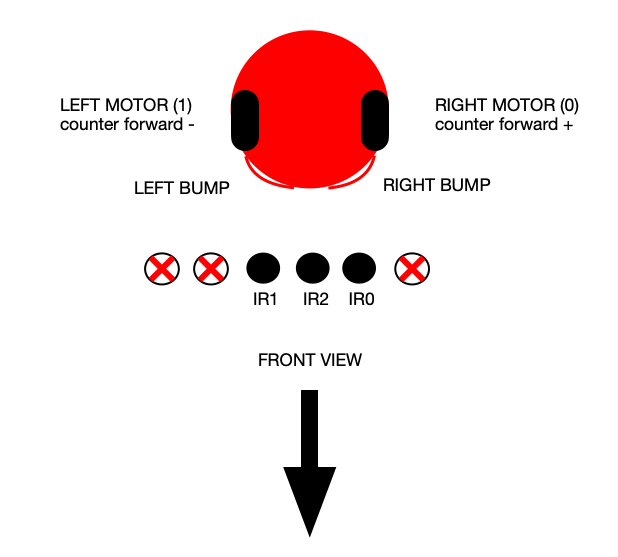

# MIRTO-Emulator

This is a software emulator for the Racket-based MIddlesex RoboTic platfOrm (MIRTO). The purpose of this emulator is to allow students to experiment with their code in the absence of a physical robot.

## How to install it

Just download this repository (select the green button "Clone or Download" on the right, above the list of files). Simply add the library to your Racket project and you are ready to go. See examples in the examples/ directory if you need further guidance

## How to use it

When you launch a Racket program that includes MirtoEmulatorGui.rkt, a new window will appear. This window is composed of two main areas, a control panel (on the right) and a bot arena (on the left):

### Control Panel

The control panel includes the display, the button panels (potentiometer and push-button), the graphical wheels status, the bumpers control and the infrared gui status. In this area you simulate the "physical interaction" with the robot, as follows:
- potentiometer: dragging up or down with the mouse (value range 0-1023)
- push-button: left click on it to press the button, when released the button is set to released
- bumpers: by clicking on left, center, right it is possible to press one or both the bump sensors. If pressed for long time, the dragging option is enabled.

## Bot arena

The bot arena is used to display the bot movement. The start position is set at x:80 y:300 z:0, close the black line, but it is possible to interact to change the coordinates and the direction.
Clicking on the bot with the left mouse button, the positioning mode is enabled: to move the bot simply move the pointer in the positioning mode and click again the mouse left button to release the robot. It is possible to rotate the bot in the positioning mode clicking the mouse right button. It is possible to choose between height positions (0° 45° 90° 135° 180° 225° 270° 315°).
This figure depicts the various components and their placement:

## Additional details

It is possible to replace the bg file drawing a black line on a white background, just replace the file in the static/ directory (or change the name in 
Background image information:

- WIDTH 500px
- HEIGHT 500px
- settings: bitmap 1bit
- brush: 6 black
- background: white
- format: png

## Limitations and TODO

- IR sensors are effectively on/off
- Improve GUI
- Support ASIP protocol over TCP connection (long term)
